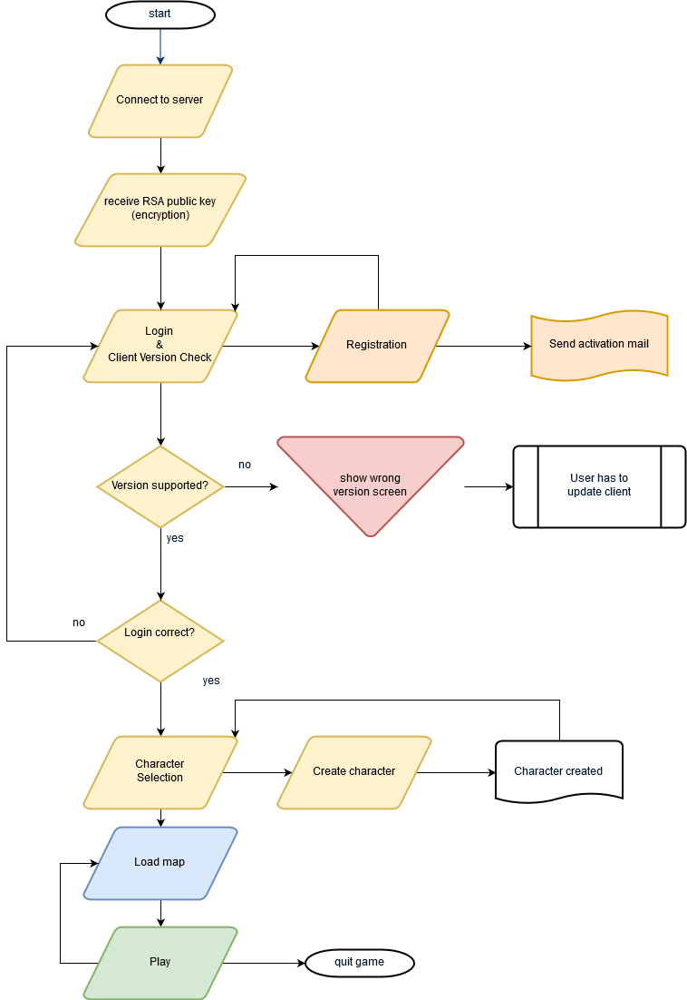

# MMO Engine - Client

Another try to build a mmo game client.

[](https://travis-ci.org/JuKu/mmo-engine-client)
[](https://sonarcloud.io/dashboard/index/com.jukusoft%3Ammo-engine-client) 
[](https://sonarcloud.io/dashboard/index/com.jukusoft%3Ammo-engine-client) 
[](https://sonarcloud.io/dashboard/index/com.jukusoft%3Ammo-engine-client) 
[](https://sonarcloud.io/dashboard/index/com.jukusoft%3Ammo-engine-client) 
[](https://sonarcloud.io/dashboard/index/com.jukusoft%3Ammo-engine-client) 
[](https://sonarcloud.io/dashboard/index/com.jukusoft%3Ammo-engine-client) 
[](https://sonarcloud.io/dashboard/index/com.jukusoft%3Ammo-engine-client) 
[](https://sonarcloud.io/dashboard/index/com.jukusoft%3Ammo-engine-client) 

[](https://sonarcloud.io/dashboard?id=com.jukusoft%3Ammo-engine-client)

## Layers

  - **Application Layer** (hardware & os - mainly platform-dependent things and core)
  - **Game Logic Layer** (game logic)
  - **Game View Layer** (game presentation - renderer & sound, also networking belongs to game view)
      * **Network Layer**
  - **Main** & **Desktop** (application startup)
  
All this maven modules are dependencies from **main module** which are called from desktop module.
  
Additional modules:

  - Shared Commons Library (shared with proxy & gameserver, includes network protocol)
  - desktop (contains natives for different platforms, belongs indirect to application layer)
  
## Game Directories

  - data (all game specific data)
  - temp (temporary files, write access required)
  - docs (Documentation, will not be copied into zip archiv)
  - assets (Work in Progress directory for artists, will not be copied into zip archiv)
  - config (configuration files for game engine - but no game specific configuration files!)
  
## Flow Chart


  
## Deploy shared-commons-library

```bash
mvn clean install deploy -DuniqueVersion=false
```

**Important**! If anything in shared-commons-library was changed, you have to increment version, else proxy server maybe doesn't get the right snapshot.
  
## Rebuild texture atlases

**Important**! Textures which will be packed to texture atlases with data/misc/packer/packer.json config file will be cached in temp directory.\
To rebuild them, you have to clear the cache with this optional parameter:

```text
-DclearCache="true"
```
  
## Build ZIP archiv

Maven:
```bash
mvn clean install
```

Then you can find a ZIP Archiv in directory **desktop/target** with all files required for game.

## Z-Level

Finally a little not about the **z-level**. By default, 2D games have only two axes: x and y.\
But maybe you also want to support a "render order" or even floors and underground tunnels.\
Then you need a **render order** and a specific system of layers to hide or show.\
I have introduced a z-level system as follows:\
\
**Every** tmx layer requires a **z-level**. Else the client cannot load them.\
Additionally, you have to make the render order in tiled, so it's already right in tmx format.\
Next all your layers get a z-level like this: **floor.renderOrder**\
The player is rendered on z-level **1.5** by default.\
\
For **example**:\
z-level "1.0" is the **ground floor** and "2.0" is the second floor.\
If you want to introduce a layer with street lights whose lamps should hanging over the player, you need a z-level "1.6".\
But **attention**! If the player is in second floor, the lamp will not be rendered!

## Special thanks

Great thank you to **Christoph Engelbert** ([noctarius](https://blog.sourceprojects.org/)), **Daniel Ludwig** (code-disaster, [Pathway](http://pathway-game.com)) and **Mario Zechner** (badlogic) for many, many tips!